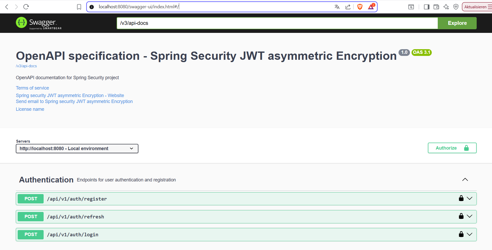
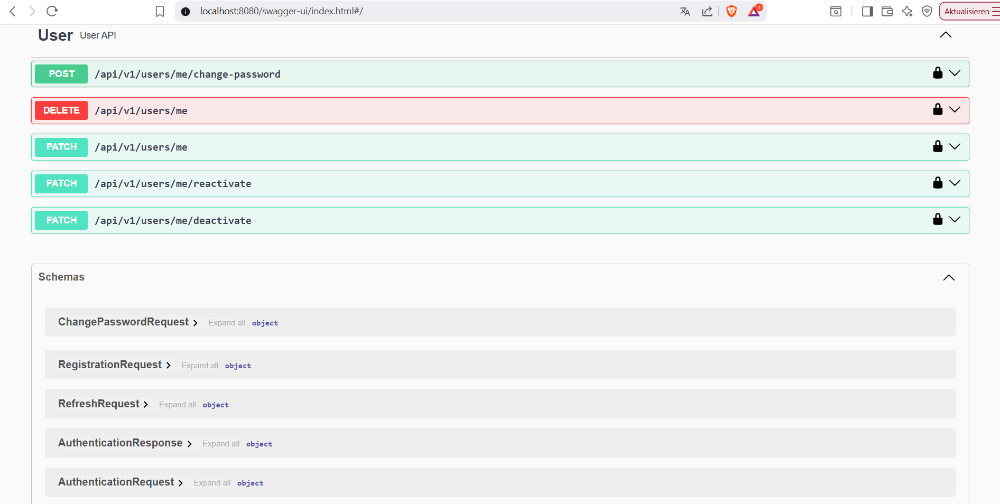

# Project Demo:  [Demo link](https://spring-security-488816087046.europe-west1.run.app/swagger-ui/index.html)





# 🔐 JWT Security with Asymmetric Encryption

This guide explains the importance of **asymmetric encryption** in securing JWTs (JSON Web Tokens), how to generate your private/public keys, and compares symmetric and asymmetric encryption approaches.

---

## 📌 Why Asymmetric Encryption?

Asymmetric encryption enhances security by using **two keys**: a **private key** to sign the token and a **public key** to verify it.

### Key Benefits:
- ✅ The **private key** remains secure on the server and is never shared.
- ✅ The **public key** can be distributed to any service or client that needs to verify the token.
- ✅ Ideal for **microservices**, **3rd-party integrations**, and **stateless authentication**.

---

## 🔧 How to Generate RSA Key Pair

You can use `openssl` to generate the keys from the command line.
Go to directory `src/main/resources/keys/local-only`  and run the following commands:

**_NB:_ Ensure you have `openssl` installed on your machine.**

### 1. Generate a 2048-bit Private Key
```bash
openssl genpkey -algorithm RSA -out private_key.pem -pkeyopt rsa_keygen_bits:2048
```

### 2. Extract the Public Key from the Private Key
```bash
openssl rsa -pubout -in private_key.pem -out public_key.pem
```

Now you have:
- `private_key.pem` — used to **sign** JWTs
- `public_key.pem` — used to **verify** JWTs

---

## 🔐 Symmetric vs Asymmetric Encryption

| Feature                  | Symmetric Encryption             | Asymmetric Encryption                 |
|--------------------------|----------------------------------|---------------------------------------|
| 🔑 Keys                  | One shared secret key            | Public key and private key pair       |
| 📦 Token Signing & Verifying | Same key is used for both       | Private key signs, public key verifies |
| 🔒 Key Sharing Risk      | High — must be shared securely   | Low — public key is openly sharable   |
| 🤝 Use Case              | Internal APIs, small-scale apps  | Public APIs, microservices, JWTs      |
| ⚡ Performance           | Faster                           | Slightly slower                       |
| 🛡️ Security              | Less secure in distributed setup | Stronger in distributed systems       |

---

## 🚀 How to Run the Application

### Prerequisites

Make sure you have the following installed on your machine:
- ✅ **Docker** (version 20.10 or higher)
- ✅ **Docker Compose** (version 2.0 or higher)

### Quick Start

1. **Clone the repository** (if not already done):
   ```bash
   git clone https://github.com/SonnyHardy/Spring-security-asymmetric-encryption.git
   cd Spring-security-asymmetric-encryption
   ```

2. **Create the required key files** (if not already generated):
   Go to the directory `src/main/resources/keys/local-only` and run:

   **_NB:_ Ensure you have `openssl` installed on your machine.**

   ```bash
   # Generate RSA private key
   openssl genpkey -algorithm RSA -out private_key.pem -pkeyopt rsa_keygen_bits:2048
   
   # Extract public key
   openssl rsa -pubout -in private_key.pem -out public_key.pem
   ```

3. **Create a `.env` file** in the project root with your configuration:
   ```env
   # Database configuration
   DB_HOST=postgres
   DB_PORT=5432
   DB_NAME=spring_security
   DB_USERNAME=username
   DB_PASSWORD=password
   
   # Server configuration
   SERVER_PORT=8080

   ```

4. **Build and run the application**:
   ```bash
   # Start all services (Spring Boot app + PostgreSQL)
   docker-compose up --build
   
   # Or run in detached mode
   docker-compose up --build -d
   ```

5. **Access the application**:
    - Application: http://localhost:8080
    - Swagger UI: http://localhost:8080/swagger-ui/index.html

---

## ✅ Summary

- Asymmetric encryption is **essential for secure JWT authentication**, especially in distributed systems or when exposing public APIs.
- It separates the concerns of **signing (server-only)** and **verification (client/multiple services)**.
- You should never expose your **private key** and always store it securely (e.g., in a vault or secure secrets manager).

---

🛡️ *Security is not a feature — it's a responsibility.*
